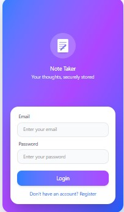
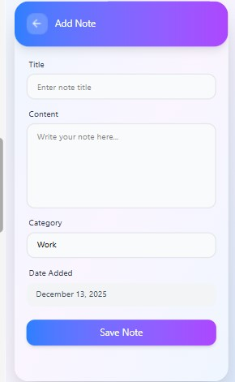
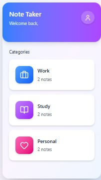

# Note Taker

A modern, mobile-first notes application built to help users create, organize, edit, and manage notes efficiently.  
The app focuses on clean UI, smooth user experience, and scalable architecture.

## Design Screenshots

Below are the original design screens used to build the application.  
These images are stored in the project and reflect the UI before development.

### Login Screen

### Register Screen

### View Notes Screen

### Add Note Screen

### Edit Note Screen

### Home

### Profile Screen

---

## Project Overview

This application allows users to:
- Create, edit, and delete notes
- Categorize notes (Work, Study, Personal)
- Search and sort notes
- View notes by category
- Experience real-time feedback via loading indicators and toast notifications

The project follows a structured, component-driven development approach with a strong focus on performance, maintainability, and user experience.

---

## Tech Stack

### Frontend
- **React Native**
- **Expo (Expo Router)**
- **TypeScript**
- **Redux Toolkit** (State Management)
- **Async Thunks** (API handling)
- **React Native Toast Message** (User feedback)
- **React Native Safe Area Context**

### Backend
- **REST API** (Custom backend)
- **JWT Authentication**

### Design
- **Figma**
- **Figma Make (AI-assisted design)**

### Tooling
- **ChatGPT / Claude / GitHub Copilot**
- **VS Code**
- **Git & GitHub**

---

## Development Process

A detailed explanation of the full development process (planning → design → implementation → optimization → deployment) is documented here:

**Development Process Document (Google Drive):**  
[`Development Process`](https://docs.google.com/document/d/15L0YPfjK6bCwIItb4TaBNUb5TMdrL_-gYfVJ0nCk4uM/edit?usp=sharing)

---

## How to Use the App

### Download & Install
- Download the APK file from the link below:
  
**APK Download:**  
[`Download apk here`](https://expo.dev/accounts/siyabonga_khanyile/projects/Notetaker/builds/001734cd-2804-42da-b1f4-63b7bb6c49c2)

- Enable **“Install from unknown sources”** on your Android device if prompted
- Install and open the app

---

### Authentication
- Register a new account or log in with existing credentials
- Authentication is required to access notes

---

### Managing Notes
- Add a new note using the **floating action button**
- Edit notes by selecting them from the list
- Delete notes when no longer needed
- Filter notes by category
- Search notes using keywords
- Sort notes by newest or oldest

---

## Architecture & Structure

- **Component-driven UI** for reusability and clean structure
- **Redux Toolkit slices** for predictable state management
- **Async thunks** for handling API requests
- **Centralized API service** for network communication
- **Expo Router** for scalable navigation

---

## Optimization & Performance

- Efficient rendering with memoization where needed
- Responsive layouts across different screen sizes
- Proper loading states and error handling
- User feedback via persistent toast notifications during async operations

---

## Security

- Token-based authentication (JWT)
- Secure storage of auth tokens
- Protected routes for authenticated users only

---

## Future Improvements

- Offline support with local caching
- Cloud sync
- Note sharing
- Rich text formatting
- Dark mode

---

## Author

**Siyabonga Khanyile**  
Software Developer (Mobile & Web)

---

## License

This project is for learning and portfolio purposes.  
All rights reserved by the author.

---

